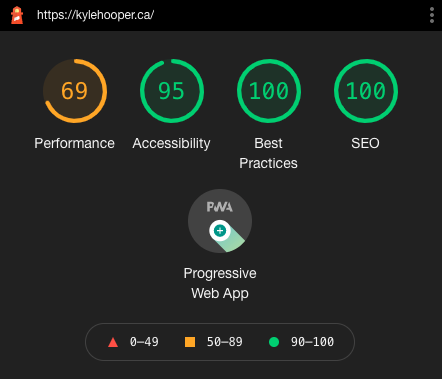

View the live site here: [kylehooper.ca](https://www.kylehooper.ca/)

I created this blog site for Kyle Hooper as a portfolio piece as well as a resume. Using NuxtJS and Netlify CMS, I created a fast loading website with a full-featured CMS for the client to update the site on their own!

I styled the page using Tailwind CSS which had been optimized for Vue projects. I chose the Netlify CMS to host the site as a static site to maximize the speed and development workflow without the client needing to know any code.
